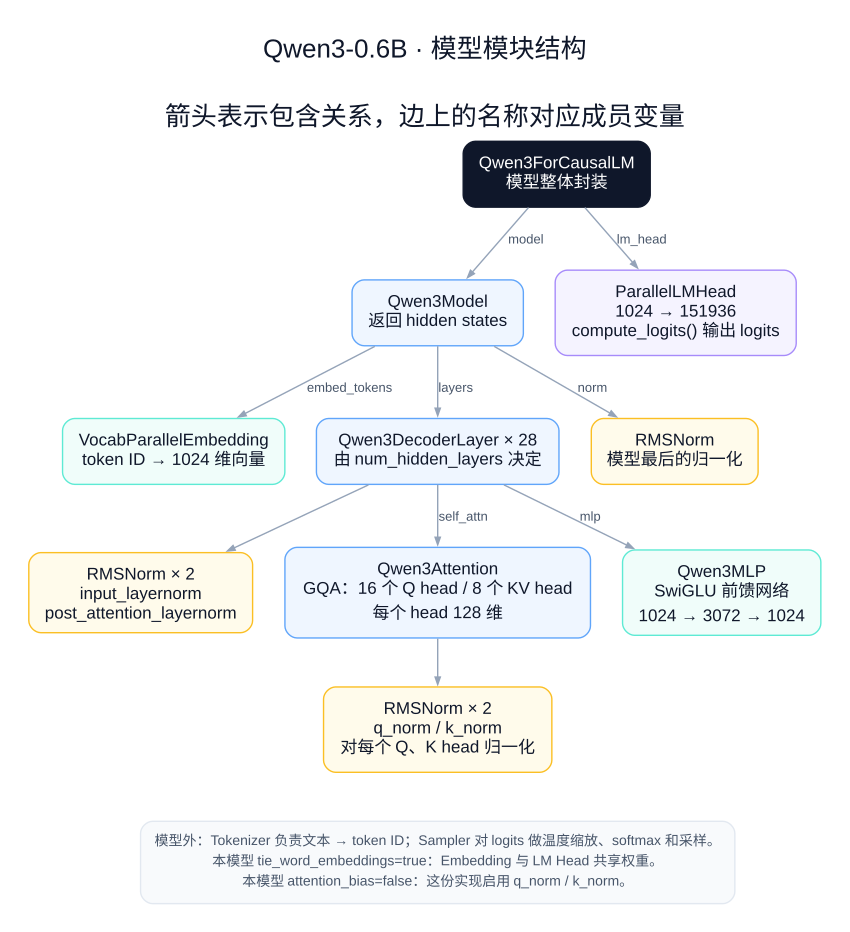
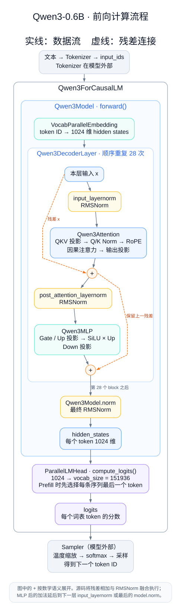

> nano-vllm的github项目链接：https://github.com/GeeeekExplorer/nano-vllm

## 0. 简介

nano-vllm以Qwen3-0.6B模型为例实现了一套简单但高效的推理框架，支持 TP通信/kv cache/运行调度 等等，其中很多思路都是vllm思路的简化版，适合在正式学习vllm框架前，提前建立 LLM高性能推理 的一些基本认知。本文尝试基于nano-vllm源码进行解析，梳理个人的学习理解。

## 1. 模型架构
### 1.0 Qwen3-0.6B的模型架构

从 Qwen3-0.6B 的config.json里，我们可以得知以下信息：
- 这个模型使用了GQA（num_attention_heads=16，但实际的kv head=8，所以两个query head共用一个kv head）。
- 每个head的维度是128维。这里有个小点：hidden_size=1024，但是 Attention 算出来的初始结果是2048维，所以模型在Attn尾部的转换矩阵还负责把2048维降到1024维
- intermediate_size=3072，作为MLP组件的中间维度
- hidden_act="silu", 说明模型MLP处使用silu作为激活函数
- num_hidden_layers=28，说明模型共有28个 Attention+MLP 
- max_position_embeddings=40960，后续代码实现时的ROPE参数预生成也是按这个值进行的。但模型说明中给出的最长上下文长度是32k。
```json
{
  "head_dim": 128,
  "hidden_act": "silu",
  "hidden_size": 1024,
  "initializer_range": 0.02,
  "intermediate_size": 3072,
  "max_position_embeddings": 40960,
  "max_window_layers": 28,
  "model_type": "qwen3",
  "num_attention_heads": 16,
  "num_hidden_layers": 28,
  "num_key_value_heads": 8
}
```

### 1.1 模型代码

Qwen3-0.6B 的整体模型代码见 `nanovllm/models/qwen3.py`，详细结构大致如下图。我们依次查看代码。


#### 1.1.1 VocabParallelEmbedding 和 ParallelLMHead

- VocabParallelEmbedding
`VocabParallelEmbedding`负责将token ID转换为对应的embedding(对应forward代码 `F.embedding(x, self.weight)`)。这里nano-vllm支持了TP。思路也比较直观，将vocab_size均分到不同的rank上，然后前向时只处理自己负责的这部分token ID, 把其他的位置都置0，这样最后通过一次`all_reduce`求sum后，所有rank都能拿到全部embedding（类似于 all_reduce([1,0], [0,1]) -> [1,1], [1,1]）
```python
# __init__
self.num_embeddings_per_partition = self.num_embeddings // self.tp_size
self.vocab_start_idx = self.num_embeddings_per_partition * self.tp_rank
self.vocab_end_idx = self.vocab_start_idx + self.num_embeddings_per_partition
# forward
mask = (x >= self.vocab_start_idx) & (x < self.vocab_end_idx)
x = mask * (x - self.vocab_start_idx)
...
y = mask.unsqueeze(1) * y
dist.all_reduce(y)
```
- ParallelLMHead
`ParallelLMHead`负责将Model的输出投射到vocab_size上，变成最终的logits。这里代码让 ParallelLMHead 复用了 VocabParallelEmbedding 的初始化流程和weight_loader流程，因为两者的权重shape一致。又由于最终只用让rank0计算output_token，所以这里最终只将所有logits gather到rank0上。
```python
if self.tp_size > 1:
    all_logits = [torch.empty_like(logits) for _ in range(self.tp_size)] if self.tp_rank == 0 else None
    dist.gather(logits, all_logits, 0)
    logits = torch.cat(all_logits, -1) if self.tp_rank == 0 else None
```
- 其他
    - qwen3-0.6B的配置里有`"tie_word_embeddings": true`, 对应的代码逻辑在 `Qwen3ForCausalLM`, 这会让`ParallelLMHead` 和 `VocabParallelEmbedding` 共用同一个权重。但这个配置并不是必须的，因模型而异。
    ```python
    if config.tie_word_embeddings:
        self.lm_head.weight.data = self.model.embed_tokens.weight.data
    ```

#### 1.1.2 Qwen3Attention

`Qwen3Attention`中 通过 `QKVParallelLinear` 计算得到 Q/K/V 矩阵；Q/K做逐 head RMSNorm，然后加上rope位置信息；过`Attention`；最终通过`self.o_proj`从2048维(num_attention_heads*head_dim)转换到 1024(hidden_size)。
- `QKVParallelLinear`
这里代码将Wq/Wk/Wv 三个参数放到一个大tensor里，因此 x@Wq / x@Wk / x@Wv 这三个矩阵乘法可以融合到一个矩阵乘，后续再将output split即可。具体的参数布局见weight_loader里。为了实现这个效果，Qwen3ForCausalLM中定义了一个packed_modules_mapping，方便在参数加载时执行指定逻辑。
    ```python
    if loaded_shard_id == "q":
        shard_size = self.num_heads * self.head_size
        shard_offset = 0
    elif loaded_shard_id == "k":
        shard_size = self.num_kv_heads * self.head_size
        shard_offset = self.num_heads * self.head_size
    else:
        shard_size = self.num_kv_heads * self.head_size
        shard_offset = self.num_heads * self.head_size + self.num_kv_heads * self.head_size
    param_data = param_data.narrow(self.tp_dim, shard_offset, shard_size)
    loaded_weight = loaded_weight.chunk(self.tp_size, self.tp_dim)[self.tp_rank]
    param_data.copy_(loaded_weight)
    ```
    在multi-head多头机制下，TP思路直接按照head切分即可，这样kv cache也能跟着head部署到对应的gpu上，head和head之间不存在额外的通信负担。注意到这里`QKVParallelLinear`继承了`ColumnParallelLinear`（输出维切分）,实际上也是在按head切分。以world_size=2为例，rank0的 Q head 的计算量为 [ctx_len, emb_dim] @ [emb_dim, num_head(0-7) *  head_dim] = [ctx_len, num_head(0-7) * head_dim]；rank1得到 [ctx_len, num_head(8-15) * head_dim]。(PS: 矩阵维度统一采用[in, out]的表达形式)
- `ROPE`
ROPE的原理此处不展开了。RoPE 在每个 head 内独立进行，各 head 使用相同的位置和频率规则，因此按 head 做 TP 不会改变 RoPE 的计算，也不需要额外通信。另外值得一提的是，nano-vllm这里实现的是split-half模式，这个需要和模型训练时的ROPE方式对上。
- `Attention`
Attention部分用了flash_attention库，这里的原理暂不扩展。另外这里会涉及到 kv cache 的管理，这个后面讲调度实现机制再说。
- `self.o_proj(RowParallelLinear)`
`o_proj`在这里除了线性转换的作用外，还负责将各head的输出映射为hidden_size。又因为上面按照head做了TP，所以这里需要对应的实现TP。上面的输出维切分到了这里就变成了输入维切分。所以这里的TP思路就变成了 `[ctx_len, num_head(0-7) * head_dim] @ [num_head(0-7) * head_dim, hidden_size] = [ctx_len, hidden_size]`（rank0 部分），最后再做一次all_reduce加上每个rank的元素。但是这里all_reduce还要注意bias的场景，避免bias被多次累加。
```python
y = F.linear(x, self.weight, self.bias if self.tp_rank == 0 else None)
if self.tp_size > 1:
    dist.all_reduce(y)
```

#### 1.1.3 Qwen3MLP

`Qwen3MLP` 主要实现了一个 SwiGLU，也做了一个小优化：把 up 和 gate 放到一个大矩阵里一次计算（`MergedColumnParallelLinear`），然后`SiluAndMul`中执行 silu 和 逐元素乘法，最后用一个 `RowParallelLinear`(down) 得到结果。

$$
\mathrm{MLP}(X)
=
\left[
\mathrm{SiLU}(XW_{\mathrm{gate}})
\odot
(XW_{\mathrm{up}})
\right]
W_{\mathrm{down}}
$$

$$
\mathrm{SiLU}(z)=z\cdot\sigma(z)=\frac{z}{1+e^{-z}}
$$

这里的TP还是类似Attention的拆分模式，计算 up 和 gate 时按输出维拆，计算 down 时按输入维拆，中间的 `SiluAndMul` 不需要知道完整矩阵，所以也自然支持这种TP拆分方式。

#### 1.1.4 参数加载
为了完成参数加载，qwen3.py中的模型代码命名 尽量 和 safe_tensors文件的keys命名 保持一致。实在无法保持一致的部分，通过 `packed_modules_mapping` 转到特定的实现里。

#### 1.1.5 Qwen3-0.6B的前向流程示意

整个模型的前向流程如下图所示：


## 2. nano-vllm的调度原理
模型调度运行的代码主要在`nanovllm/engine/`目录下，各文件大体功能如下：
- sequence.py: 定义 `Sequence`, 作为每个req最小请求调度单位
- block_manager.py: 管理 kv cache的block
- model_runner.py: 模型运行相关
- scheduler.py: 调度相关，决定一次跑多少个请求，计算多少token
- llm_engine.py: 提供`LLMEngine`, 供上层使用
### 2.1 初始化
LLMEngine会初始化两个主要组件：`ModelRunner`和`Scheduler`。
- `ModelRunner`
作为模型运行的主要函数：初始化时负责定义模型结构，加载模型参数，warmup，计算kv cache空间并预分配，capture_cudagraph。nanovllm只支持单GPU/单机多GPU的场景，对于多GPU场景下创建shm以做runner间的通信。这里讲一下nanovllm的kv cache空间分配思路。

nanovllm按Block进行管理，每个Block有 block_size 个token的 cache块；对于单个token的cache，其中k和v各需要一份，然后每一个layer需要一份，每一份cache长度是 num_kv_head * head_dim，所以能得到单个Block的 block_bytes。随后按照GPU目前剩余的空间决定能申请 num_kvcache_blocks 个 block，然后直接创建一个torch大数组。最后把cache空间写入 Attention的 k_cache/v_cache变量中，完成cache空间的分配和初始化。
- 剩余空间怎么计算：gpu显存*特定比例(0.9) - 目前已使用的空间(used) - warmup估计出的额外开销(peak-current)
```python
block_bytes = 2 * hf_config.num_hidden_layers * self.block_size * num_kv_heads * head_dim * hf_config.dtype.itemsize
config.num_kvcache_blocks = int(total * config.gpu_memory_utilization - used - peak + current) // block_bytes
self.kv_cache = torch.empty(2, hf_config.num_hidden_layers, config.num_kvcache_blocks, self.block_size, num_kv_heads, head_dim)
layer_id = 0
for module in self.model.modules():
    if hasattr(module, "k_cache") and hasattr(module, "v_cache"):
        module.k_cache = self.kv_cache[0, layer_id]
        module.v_cache = self.kv_cache[1, layer_id]
        layer_id += 1
```
- `Scheduler`
Scheduler在初始化 BlockManager 时，会用到上面计算出来的 num_kvcache_blocks。BlockManager 初始化 N 个 Block，然后放入 free_block_ids 中。

### 2.2 schedule调度
用户的请求通过 generate 传入 LLMEngine 后，首先通过 add_request 函数构造出一个 Sequence, 加入 scheduler 的 waiting list中；随后由 scheduler.schedule() 进行调度。

schedule调度优先尝试调度 waiting list 的 seq，对应的是prefill阶段。 num_batched_tokens 作为本次step已经分配出去的计算额度，max_num_batched_tokens 是本step允许的最大计算额度。这里采用 prefill 优先的贪心调度：在请求数量、token 预算和 KV 空间允许的范围内，尽量调度 waiting 队列中的请求进行 prefill。只要本轮调度了 prefill，就直接返回；仅当本轮没有可执行的 prefill 时，才调度 running 队列进行 decode。这有助于积累可参与 decode 的请求，但也可能推迟已有请求的 decode。
- block_table 为空，表示需要重新建立 block 映射，包括新请求和被抢占后恢复的请求；can_allocate 会检查可复用前缀及剩余容量，如果cache剩余空间不允许则跳出prefill阶段。
- 即使 block_table 为空，也可能通过全局 hash 索引找到仍有效的前缀缓存block 来进行复用，所以 block_manager.can_allocate 通过hash_id也判断了复用情况（`block_id in self.hash_to_block_id and self.blocks[block_id].token_ids == token_ids`）。
- 没有 seq.block_table 的情况下，为当前完整序列建立 block 映射：复用命中的前缀 blocks，为剩余部分分配新 blocks，并按序写入 block_table。chunked prefill 分轮计算，但会在第一个step时提前建立完整映射。
- 这里判断block复用的逻辑采用最长前缀原则，一旦某个block不符合条件，该block及随后的token都需要重新计算。
- 这里为了避免两个seq更新同一个block的情况，只检查除最后一块以外的完整前缀 blocks；最后一块无论是否填满，都不参与复用。（对应 can_allocate 的循环条件是： `for i in range(seq.num_blocks - 1):`）。
- 目前nanovllm有一个只对当前batch的第一个seq才支持chunked。也就是说，本轮已调度其他请求时，后续请求若不能完整放入剩余预算，就留到下一轮；成为下一轮首个请求后，才允许 chunked prefill。（个人觉得这里的逻辑删除了，允许第二个seq用剩余的token计算额度，也是合理的）
```python
if remaining < num_tokens and scheduled_seqs:  # only allow chunked prefill for the first seq
    break
```
- seq一旦prefill完成，即从waiting队列移到running队列，其状态也改为 SequenceStatus.RUNNING。

在实在无法继续prefill的时候，scheduler开始对running队列进行decode。decode条件下每条被调度的seq只计算一个token。
- 由于之前prefill可能占用过多cache空间，所以有可能某一次 decode step调度 时无法 allocate 新空间了。此时nanovllm从running尾部开始将seq移回waiting，并释放其cache空间（`preempt`）。注意因为此时空闲cache空间也不够 该移除的seq 再做一次prefill，所以在随后的step中 该 seq 会触发 prefill阶段的 can_allocate fail break 逻辑，通常直到某个running seq结束释放空间后才有机会。
- 需要注意block有引用计数，因此可能有抢占了seq但无法完全释放其使用的cache空间的场景。
- 注意block释放的场景，`_deallocate_block`只把 block_id 从 used list 挪到 free list，但没有实际删除 hash_id、token_ids、hash_to_block_id 等数据。因此后续新seq如果有相同的hash_id 和 token_ids，还是可以通过 hash_to_block_id 找到该 block 然后进行复用。空闲 block 若被 _allocate_block() 分配用于新内容时，才会删除旧 hash 映射并 reset；在此之后旧前缀就不能再通过该 block 命中。
```python
# can_allocate()
for i in range(seq.num_blocks - 1):
    ...
    if block_id == -1 or self.blocks[block_id].token_ids != token_ids:
        break
    num_cached_blocks += 1
    if block_id in self.used_block_ids: # 这里已经在考虑block_id在free list里的场景了
        num_new_blocks -= 1
# allocate()
for i in range(num_cached_blocks):
    ...
    if block_id in self.used_block_ids:
        block.ref_count += 1
    else: # 从 free list 中复用一个block_id
        block.ref_count = 1
        self.free_block_ids.remove(block_id)
        self.used_block_ids.add(block_id)
```

schedule 完成后，调度器返回本轮执行的 seqs 和 is_prefill。每个 seq 中： num_cached_tokens 表示已有有效 KV 的前缀长度，num_scheduled_tokens 表示本轮待计算的 token 数量，block_table 指向已为该序列分配的物理 KV blocks，token_ids记录了prompt 和所有已生成 token。

### 2.3 model run

#### 2.3.1 prepare_prefill
prefill会将多个seq的token ids放入一个一维tensor中，避免二维tensor([bs, len])由于seq长短不一而引入的无谓的padding。
- input_ids: 记录本轮计算的token，seq.token_ids[num_cached_tokens : num_cached_tokens+num_scheduled_tokens]
- positions: 记录这些token的实际位置（Q和K的ROPE要用）， range(num_cached_tokens, num_cached_tokens+num_scheduled_tokens)
- cu_seqlens_q: 记录多个seq的 query len 的前缀和，和 input_ids中该seq_len的结束位置对应
- cu_seqlens_k: 记录多个seq的 k/v len 的前缀和。和 cu_seqlens_q 的不同处是 k的长度要包含所有数据，即num_cached_tokens+num_scheduled_tokens；而q的长度只包含这次需要计算的数据，即num_scheduled_tokens
- max_seqlen_q、max_seqlen_k: 最大的长度值
- slot_mapping: 每个 input_id 在 整个cache大数组 中的 绝对slot位置，可以通过block_table、block_size、start/end在block中的相对位置计算得到。
- block_tables: 本次batch只要有一条seq存在 已有 KV（num_cached_tokens > 0），即构造 block_tables 让底层flash_attention从 kv paged cache 读取完整上下文；否则直接使用本轮生成的 K/V（对应attention.py#L65的逻辑）。正式推理可以统一走 paged KV，但 warmup 尚未分配 cache，需要单独保留无 cache 的路径。
```python
if cu_seqlens_k[-1] > cu_seqlens_q[-1]:    # prefix cache
    block_tables = self.prepare_block_tables(seqs) # 仅在存在已有KV的条件下构造 block_tables ，让底层使用 paged KV 逻辑
```

#### 2.3.2 prepare_decode
decode逻辑会相对简单些。
- input_ids: query只用到上一次生成的token，所以此时只传入 seq.last_token
- positions: 记录该input token的位置信息
- context_lens: 记录此时seq的长度，便于cache提取k/v
- slot_mapping: 由于decode每次只加入本次query token的kv结果，所以这里也只记录seq.block_table[-1]的最新可写入slot位置即可（seq.block_table的扩容逻辑在 scheduler.schedule()中）

decode阶段有一个错位，第n步会产出第n+1个token，然后这个token在n步结束时放入到seq.token_ids里了。随后第n+1步的schedule按照新的seq.token_ids长度判断是否扩容，然后拿第n+1个token做前向，产生kv数据写入到cache，最终得到第n+2个token。

#### 2.3.3 run_model
prepare函数会返回此次 input_ids 和 positions 信息，attention需要的其他数据通过 Context 这个全局变量传递。这里可以看到，非eager模式下nanovllm支持 cudagraph 重放机制。具体原理是：初始化时按照不同的seq数量执行graph，并记录捕获的cudagraph；然后在实际decode调度时，找到不小于当前 batch size 的最小已捕获档位的cudagraph，然后replay即可。这样做的好处是一次提交就能跑完 模型主干前向，避免CPU多次提交kernel。
- 注意：replay机制需要用相同的tensor地址，所以可以看到capture函数里把用到的几个变量都先预定义好，在实际decode时将tensor数据copy上去执行。
- 注意：目前只有decode支持capture/replay机制

#### 2.3.4 kv cache记录
此时我们再回到attention.py中，除去flash_attention的执行逻辑外，这里还有一个是kv数据写入cache空间的逻辑。回顾如下的cache空间布局，每个attention中的cache布局已经是 `(config.num_kvcache_blocks, self.block_size, num_kv_heads, head_dim)`。prepare的时候我们已经在 slot_mapping 中记录了 每个input_id -> slot_id 的对应关系。所以此时通过 slot_id * (num_kv_heads*head_dim) 即定位到该 input_id kv数据的cache写入位置。这里代码通过triton完成了一个简单的cuda kernel并发写入。

#### 2.3.5 后处理
decode阶段，每个seq的input id只有一个token，因此 模型输出 hidden states → LM Head 得到 logits → Sampler 得到 下一个token ID。但prefill阶段，每个seq会有一堆的input tokens，对应多个outputs，因此 `ParallelLMHead` 也会根据is_prefill 和 cu_seqlens_q 做一下特殊处理，先选每个seq的本轮最后一个位置的hidden states，然后再计算logits.
```python
if context.is_prefill:
    last_indices = context.cu_seqlens_q[1:] - 1
    x = x[last_indices].contiguous()
```
在模型完整运行并拿到下一个token ID后，llm_engine调用`postprocess`进行后处理：为本轮新写满的block更新hash值；更新num_cached_tokens；将num_scheduled_tokens置0；将这个 output_token 放入seq中，方便下一次decode使用（注意：这里特意避免了将chunked prefill时的中间step的临时output作为输出）；判断seq是否finish。
```python
if is_prefill and seq.num_cached_tokens < seq.num_tokens:
    continue
```

#### 2.3.6 Sampler
随机选取output token的代码实现并不复杂。这里实现了一种 Gumbel-Max 采样：单次结果具有一定的随机性，但是指数分布让各token的选中概率符合probs。
```python
logits = logits.float().div_(temperatures.unsqueeze(dim=1))
probs = torch.softmax(logits, dim=-1)
sample_tokens = probs.div_(torch.empty_like(probs).exponential_(1).clamp_min_(1e-10)).argmax(dim=-1)
```

## 3. 后记
nano-vllm 作为一个精简版的LLM推理实现，足以让初学者感受LLM推理时的大体流程和思路，但又不至于迷失在vllm/sglang这种庞大代码库的复杂实现里。基于这种代码框架，还有一些有意思的功能拓展/改造可以做，比如：支持一下MOE架构，支持一下MLA架构，支持投机解码等（大模型说可以，但就是要费点时间）。
